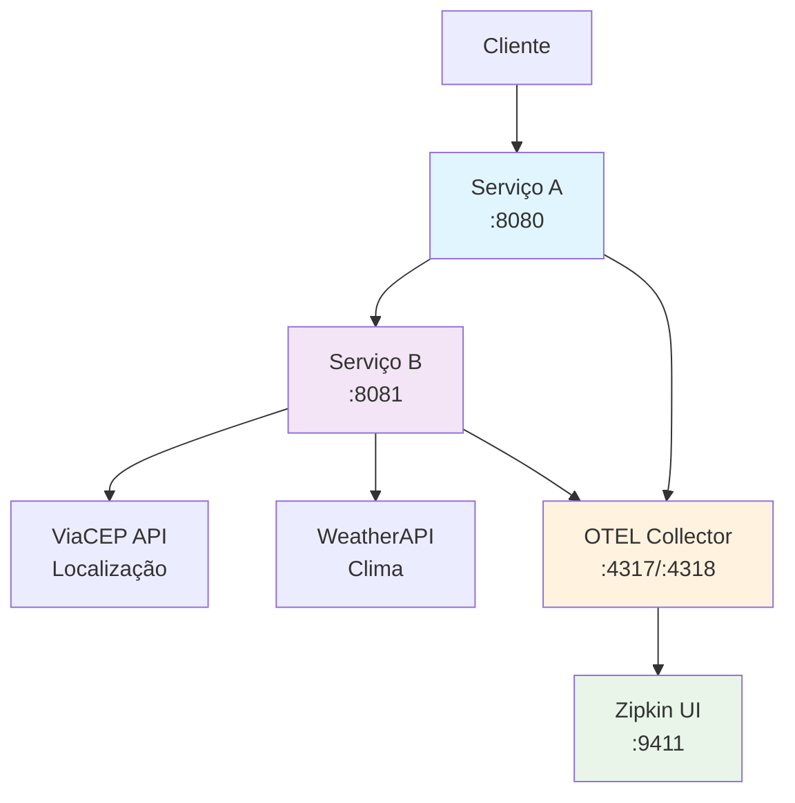

# 🌡️ Sistema de Temperatura por CEP com OpenTelemetry e Zipkin

[](https://golang.org/)
[](https://www.docker.com/)
[](https://opentelemetry.io/)
[](https://opensource.org/licenses/MIT)

Este projeto implementa um sistema distribuído em Go que recebe um CEP brasileiro, identifica a cidade e retorna o clima atual com temperaturas em Celsius, Fahrenheit e Kelvin. O sistema é composto por dois microserviços com observabilidade completa usando OpenTelemetry e Zipkin para tracing distribuído.

## 🚀 Funcionalidades

- ✅ Validação de CEP brasileiro (8 dígitos)
- 🌍 Busca de localização via API ViaCEP
- 🌤️ Consulta de clima via WeatherAPI
- 🔄 Conversão automática de temperaturas (C°, F°, K)
- 📊 Tracing distribuído com OpenTelemetry
- 🔍 Visualização de traces no Zipkin
- 🐳 Containerização completa com Docker
- 📈 Observabilidade e monitoramento

## ⚡ Início Rápido

```bash
# Clone o repositório
git clone https://github.com/seu-usuario/golang-mvp-otel.git
cd golang-mvp-otel

# Configure as variáveis (opcional para teste)
cp .env.example .env

# Inicie os serviços
docker-compose up --build -d

# Teste a API
curl -X POST http://localhost:8080/cep \
  -H "Content-Type: application/json" \
  -d '{"cep": "01310100"}'

# Visualize os traces
open http://localhost:9411
```

## 🏗️ Arquitetura



### Componentes

- **🔵 Serviço A**: Validação de CEP e orquestração de requisições
- **🟣 Serviço B**: Integração com APIs externas (ViaCEP + WeatherAPI)
- **🟠 OpenTelemetry Collector**: Coleta e processamento de traces
- **🟢 Zipkin**: Interface web para visualização de traces distribuídos

## 📋 Pré-requisitos

- 🐳 **Docker** (20.10+) e **Docker Compose** (2.0+)
- 🔑 **Chave da API WeatherAPI** (gratuita em [weatherapi.com](https://www.weatherapi.com/))
- 🌐 **Conexão com internet** (para APIs externas)

## ⚙️ Configuração

### 1. 📥 Clone o repositório

```bash
git clone https://github.com/seu-usuario/golang-mvp-otel.git
cd golang-mvp-otel
```

### 2. 🔧 Configure as variáveis de ambiente

```bash
cp .env.example .env
```

Edite o arquivo `.env` e configure sua chave da WeatherAPI:

```env
# WeatherAPI Key - Get your free key at https://www.weatherapi.com/
WEATHER_API_KEY=sua_chave_aqui
```

### 3. 🔑 Obtenha uma chave gratuita da WeatherAPI

1. Acesse [weatherapi.com](https://www.weatherapi.com/)
2. Registre-se gratuitamente
3. Copie sua chave da API
4. Cole no arquivo `.env`

> **💡 Dica**: O sistema funciona com dados simulados quando a chave não está configurada, ideal para desenvolvimento e testes.

## 🚀 Execução

### Usando Docker Compose (Recomendado)

```bash
# 🏗️ Construir e iniciar todos os serviços
docker-compose up --build

# 🔄 Para executar em background
docker-compose up --build -d

# ⏹️ Para parar os serviços
docker-compose down

# 🧹 Para limpar volumes e redes
docker-compose down -v --remove-orphans
```

### 🧪 Script de Teste Automatizado

```bash
# Executa testes completos da API
chmod +x test-api.sh
./test-api.sh
```

### Verificação dos Serviços

Após iniciar, os seguintes serviços estarão disponíveis:

- **Serviço A**: http://localhost:8080
- **Serviço B**: http://localhost:8081
- **Zipkin UI**: http://localhost:9411
- **OTEL Collector**: http://localhost:4317 (gRPC), http://localhost:4318 (HTTP)

## Uso da API

### 🔵 Serviço A - Endpoint Principal

**POST** `http://localhost:8080/cep`

**Request Body:**
```json
{
  "cep": "01001000"
}
```

**Responses:**

**Sucesso (200):**
```json
{
  "city": "São Paulo",
  "temp_C": 25.0,
  "temp_F": 77.0,
  "temp_K": 298.15
}
```

**CEP Inválido (422):**
```json
{
  "message": "invalid zipcode"
}
```

**CEP Não Encontrado (404):**
```json
{
  "message": "can not find zipcode"
}
```

### Exemplos de Teste

```bash
# ✅ Teste com CEP válido
curl -X POST http://localhost:8080/cep \
  -H "Content-Type: application/json" \
  -d '{"cep": "01310100"}'

# ❌ Teste com CEP inválido (formato)
curl -X POST http://localhost:8080/cep \
  -H "Content-Type: application/json" \
  -d '{"cep": "123"}'

# 🔍 Teste com CEP inexistente
curl -X POST http://localhost:8080/cep \
  -H "Content-Type: application/json" \
  -d '{"cep": "00000000"}'
```

## Monitoramento e Observabilidade

### Zipkin

Acesse http://localhost:9411 para visualizar os traces distribuídos.

**Funcionalidades disponíveis:**
- Visualização de traces end-to-end
- Análise de latência entre serviços
- Detalhamento de spans individuais
- Identificação de gargalos de performance

### Spans Implementados

**Serviço A:**
- `handle-cep-request`: Processamento completo da requisição
- `forward-to-service-b`: Comunicação com Serviço B

**Serviço B:**
- `handle-weather-request`: Processamento da requisição de clima
- `get-location-from-cep`: Busca de localização via ViaCEP
- `get-weather-from-api`: Busca de clima via WeatherAPI

## APIs Externas Utilizadas

### ViaCEP
- **URL**: https://viacep.com.br/
- **Propósito**: Busca de informações de localização por CEP
- **Formato**: `https://viacep.com.br/ws/{cep}/json/`
- **Gratuita**: Sim

### WeatherAPI
- **URL**: https://www.weatherapi.com/
- **Propósito**: Busca de informações meteorológicas
- **Formato**: `http://api.weatherapi.com/v1/current.json?key={key}&q={location}`
- **Gratuita**: Sim (com limitações)

## Conversões de Temperatura

O sistema implementa as seguintes fórmulas de conversão:

- **Celsius para Fahrenheit**: `F = C × 1.8 + 32`
- **Celsius para Kelvin**: `K = C + 273.15`

## 🛠️ Tecnologias Utilizadas

### Backend
- **Go 1.21+** - Linguagem de programação
- **OpenTelemetry** - Observabilidade e tracing
- **HTTP nativo** - Servidor web

### Observabilidade
- **Zipkin** - Visualização de traces
- **OTEL Collector** - Coleta de telemetria

### APIs Externas
- **ViaCEP** - Consulta de CEP brasileiro
- **WeatherAPI** - Dados meteorológicos

### Infraestrutura
- **Docker** - Containerização
- **Docker Compose** - Orquestração

## 📁 Estrutura do Projeto

```
golang-mvp-otel/
├── 📄 docker-compose.yml          # Orquestração dos serviços
├── ⚙️ otel-collector-config.yml   # Configuração do OTEL Collector
├── 📋 .env.example                # Exemplo de variáveis de ambiente
├── 📖 README.md                   # Documentação
├── 🧪 test-api.sh                 # Script de testes
├── 🔵 service-a/                  # Serviço A (Validação CEP)
│   ├── main.go
│   ├── go.mod
│   ├── go.sum
│   └── Dockerfile
└── 🟣 service-b/                  # Serviço B (APIs Externas)
    ├── main.go
    ├── go.mod
    ├── go.sum
    └── Dockerfile
```

## Desenvolvimento Local

### Executar Serviços Individualmente

**Serviço A:**
```bash
cd service-a
go mod tidy
OTEL_EXPORTER_OTLP_ENDPOINT=localhost:4317 SERVICE_B_URL=http://localhost:8081 go run main.go
```

**Serviço B:**
```bash
cd service-b
go mod tidy
OTEL_EXPORTER_OTLP_ENDPOINT=localhost:4317 WEATHER_API_KEY=your_key_here go run main.go
```

### Dependências Go

Ambos os serviços utilizam as seguintes dependências principais:
- `go.opentelemetry.io/otel` - Core OpenTelemetry
- `go.opentelemetry.io/otel/exporters/otlp/otlptrace/otlptracegrpc` - Exportador OTLP
- `go.opentelemetry.io/contrib/instrumentation/net/http/otelhttp` - Instrumentação HTTP

## Troubleshooting

### Problemas Comuns

1. **Erro "WEATHER_API_KEY not set"**
   - Verifique se a chave está configurada no arquivo `.env`
   - Certifique-se de que o arquivo `.env` está no diretório raiz

2. **Serviços não conseguem se comunicar**
   - Verifique se todos os containers estão na mesma rede
   - Confirme se as portas não estão sendo usadas por outros processos

3. **Traces não aparecem no Zipkin**
   - Verifique se o OTEL Collector está funcionando
   - Confirme se os serviços estão enviando traces para o endpoint correto

4. **CEP não encontrado**
   - Verifique se o CEP tem exatamente 8 dígitos
   - Teste com CEPs conhecidos como "01001000" (São Paulo)

### Logs

Para visualizar logs dos serviços:
```bash
# Logs de todos os serviços
docker-compose logs

# Logs de um serviço específico
docker-compose logs service-a
docker-compose logs service-b
docker-compose logs zipkin
docker-compose logs otel-collector
```

## 🤝 Contribuição

Contribuições são sempre bem-vindas! Para contribuir:

1. 🍴 **Fork** o projeto
2. 🌿 **Crie uma branch** para sua feature
   ```bash
   git checkout -b feature/MinhaNovaFeature
   ```
3. ✅ **Commit** suas mudanças
   ```bash
   git commit -m 'feat: adiciona nova funcionalidade incrível'
   ```
4. 📤 **Push** para a branch
   ```bash
   git push origin feature/MinhaNovaFeature
   ```
5. 🔄 **Abra um Pull Request**

### 📝 Diretrizes de Contribuição

- Siga os padrões de código Go
- Adicione testes para novas funcionalidades
- Mantenha a documentação atualizada
- Use commits semânticos (feat, fix, docs, etc.)

## 📄 Licença

Este projeto está sob a licença **MIT**. Veja o arquivo [LICENSE](LICENSE) para mais detalhes.

---

<div align="center">

**⭐ Se este projeto foi útil, considere dar uma estrela!**

Desenvolvido com ❤️ usando Go e OpenTelemetry

</div>